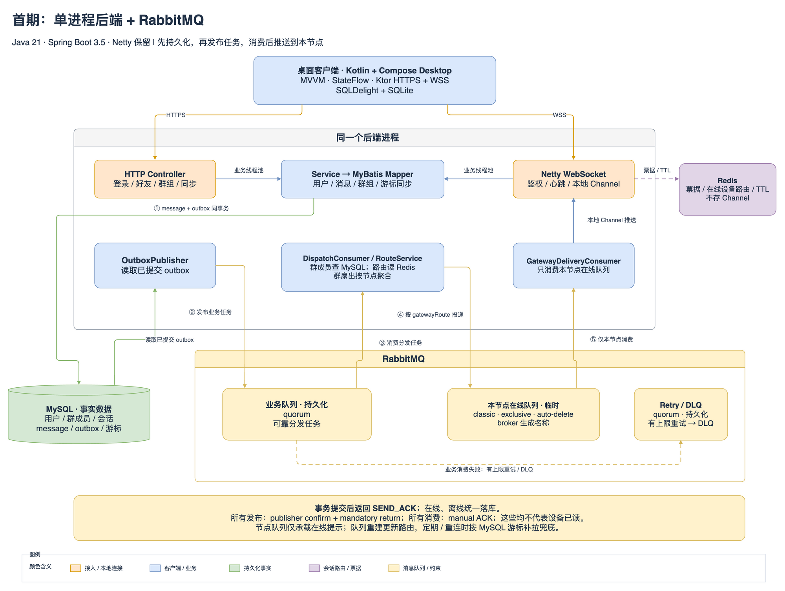
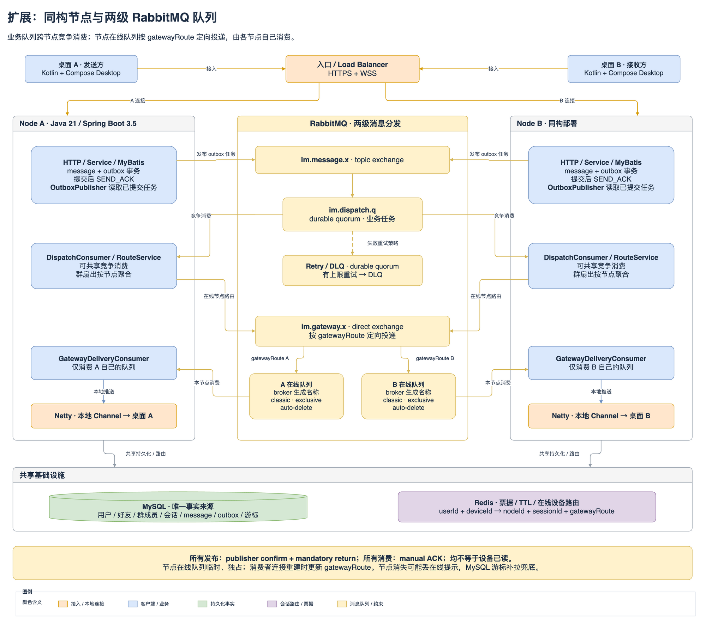

# koko-chat 架构设计

日期：2026-09-08。状态：架构基线 v1，已完成认证、好友、单聊、群聊与已读/未读最小闭环。当前实现范围以 [项目说明](../README.md) 为准；架构图中的业务组件仍是目标设计，不代表已有完整功能或压测结果。

## 1. 约束与结论

- 本仓库 `koko-chat` 是新项目；旧 IM 仅作为参考，不在旧项目中继续开发。
- 服务端采用 Java 21、Spring Boot 3.x，保留 Netty。
- 首期引入 RabbitMQ，通过 Spring AMQP 集成，承担异步分发、群消息扇出、节点定向投递、有限重试与死信处理。
- 客户端确定为 Kotlin + Compose Desktop，构建可安装的 JVM 桌面应用，统一使用 JDK 21。
- 采用按功能分包的常规分层：Controller / Netty Handler → Service → MyBatis Mapper → 数据库。首期部署一个后端进程。
- 参考用户提供的图，将 chat server、router、session registration、group registration、offline storage、pub/sub 分别映射到连接接入、路由、会话注册、群成员管理、消息同步与跨节点通知职责。
- 首期围绕账号、好友、单聊、小群聊、消息确认、历史与离线同步、在线状态形成闭环。小群暂按不超过 200 人设计。
- 参考图中的十亿用户、千万消息每秒、单机百万连接和服务器数量不作为本项目容量承诺；需要根据实际硬件、TLS、消息大小、群扇出和压测结果重新评估。

确定的架构：**Kotlin / Compose Desktop + Ktor HTTPS / WSS + Spring Boot 常规业务分层 + Netty 连接管理 + RabbitMQ 异步分发 + MySQL 消息事实源 + Redis 临时会话数据**。

RabbitMQ 队列拓扑、可靠性边界、重试与故障演练见 [消息队列设计](messaging.md)。原参考图中的 Pub/Sub 职责由 RabbitMQ 承担，Redis 负责会话路由和缓存。

## 2. 已确定的客户端技术栈

| 方向 | 选型 | 用途 |
| --- | --- | --- |
| 语言与运行时 | Kotlin/JVM + JDK 21 | 桌面业务和 Java 生态互操作 |
| 界面 | Compose Desktop（Compose Multiplatform 的桌面目标） | 登录、会话列表、聊天、联系人、群管理、设置 |
| 状态管理 | MVVM + Kotlin Coroutines + StateFlow | 单向状态流、异步任务、页面生命周期 |
| 网络 | Ktor Client + CIO engine | HTTPS API 和 WSS 长连接，服务端仍为 Netty |
| 协议 | kotlinx.serialization + JSON v1 | Java/Kotlin 通过显式字段契约交互 |
| 本地数据 | SQLDelight + SQLite JVM driver | 消息缓存、草稿、连续同步游标、待发送队列 |
| 构建与分发 | Gradle Kotlin DSL + Compose 插件 + jpackage/jlink | 构建安装包并携带所需 Java 运行时 |

客户端使用 Compose 绘制界面，采用 Kotlin/JVM 桌面目标；首期不建立 Android/iOS 工程。后续如确有移动端需求，再提取可共享代码。客户端和服务端独立构建，JDK toolchain 与 JVM target 均统一为 21。

Compose Compiler 插件与 Kotlin 插件版本保持一致；骨架已通过版本目录和 Wrapper 锁定 Kotlin、Compose、Ktor、SQLDelight 与 Gradle 的兼容组合，具体版本见 [桌面工程说明](../apps/desktop/README.md)。JDK 21 满足 Compose 桌面运行和安装包构建所需的 JDK 门槛，目标操作系统与 CPU 架构仍需按锁定的 Compose 版本验证。[Compose 兼容说明](https://kotlinlang.org/docs/multiplatform/compose-compatibility-and-versioning.html)

客户端模块、连接状态机、缓存和桌面打包见 [Kotlin 桌面端设计](desktop.md)。

## 3. 保留 Netty，接入协议采用 WSS

Netty 是服务端网络框架，WebSocket 是通信协议，两者可以同时使用。客户端确定使用 **Ktor CIO + WSS + JSON v1 协议**：

- HTTPS：登录、刷新凭证、好友和群组管理、会话列表、历史分页、增量同步。
- WSS：发送消息、服务端保存确认、实时推送、设备接收确认、已读更新、心跳和在线状态通知。
- 图片/文件现经认证 HTTP(S) 转存到 RustFS 私有桶，单文件最多 10 MiB；WSS 只传文件元数据和消息引用。

Netty 的 `WebSocketServerProtocolHandler` 负责握手与 WebSocket 控制帧，业务 Handler 处理文本/二进制消息。原 IM 的裸 TCP 端口不能直接当成 WSS 地址，需要增加对应的 Netty pipeline。[Netty 官方 API](https://netty.io/4.1/api/io/netty/handler/codec/http/websocketx/WebSocketServerProtocolHandler.html)

首期维护一套 WSS 接入。Ktor 承担 Kotlin 客户端通信，Netty 承担 Java 服务端连接处理；客户端不直接依赖服务端实体类、Spring Bean 或数据库。旧 Protostuff Java 对象协议不直接沿用。

HTTPS 与 WSS 复用受控的 Ktor HttpClient，由客户端 SessionManager 管理创建、认证、重连与关闭。连接生命周期独立于 Compose 页面重组。[Ktor WebSocket 客户端](https://ktor.io/docs/client-websockets.html)

## 4. 首期架构：一个后端进程 + 消息队列



| 组件 | 职责 | 部署方式 |
| --- | --- | --- |
| Kotlin / Compose Desktop | MVVM 界面、Ktor 连接、SQLDelight 本地缓存、待发送队列、通知 | 独立 JVM 桌面安装包 |
| HTTP Controller | 接收普通 API 请求，参数校验，调用 Service | 同一个 Spring Boot 进程 |
| Netty 接入 | WebSocket、认证、心跳、帧大小限制、本地 Channel 生命周期 | 同一个 Spring Boot 进程 |
| 业务 Service | 用户、好友、群组、消息事务、会话权限、历史与增量同步 | 同一个 Spring Boot 进程 |
| RouteService / SessionRegistry | 找到用户各设备的连接；管理连接元数据 | 同进程模块；Redis 存临时数据 |
| MyBatis Mapper | 关系数据、消息、游标、outbox 的数据库访问 | 同进程模块 |
| OutboxPublisher | 扫描已提交 outbox，发布 MQ，确认成功后更新发布状态 | 同进程后台任务 |
| DispatchConsumer / RouteService | 消费业务事件，校验接收者权限，群扇出，按节点发布在线任务 | 同进程消费者；多节点可竞争消费 |
| GatewayDeliveryConsumer | 消费本节点在线队列，校验会话并交给 Netty 推送 | 同进程消费者，只处理本机连接 |
| RabbitMQ | 持久业务队列、节点在线队列、定时重试与死信队列 | 独立基础服务，从首期引入 |
| MySQL | 用户、好友、群成员、会话、消息、读进度和 outbox | 独立基础服务 |
| Redis | 一次性连接票据、带 TTL 的会话路由、在线状态、可重建缓存 | 独立基础服务 |

本地开发建议 API 监听 8080，Netty 监听 8081，均使用配置项。部署时可由反向代理统一暴露 TLS 入口，`/api` 转发 HTTP、`/im` 转发 Netty WebSocket。客户端通过环境配置切换服务器地址。

实际 Channel 对象只放在对应进程内，不能序列化到 Redis。Router 首期是类和接口，不需要额外部署一套路由微服务。群成员由业务 Service + MySQL 管理，不单独部署 group registration 服务。

首期业务线程、MQ 生产者和消费者都在同一个 Spring Boot 进程中，RabbitMQ 单独运行。即使只有一个后端节点也经过同一套 MQ 分发路径，便于验证发布确认、消费重试和后续多节点行为。

## 5. 常规分层与目录建议

以下是目标目录；工程骨架按后端、桌面端的顺序落地，业务包随功能逐步补充：

```text
koko-chat/
├── apps/
│   └── desktop/                 # Kotlin/JVM + Compose，Gradle Kotlin DSL
├── server/                      # 一个 Spring Boot Maven 工程
│   └── src/main/java/.../koko/
│       ├── auth/                # Controller / Service / Mapper / DTO
│       ├── user/
│       ├── contact/
│       ├── group/
│       ├── conversation/
│       ├── message/
│       ├── sync/
│       ├── transport/netty/     # Bootstrap、pipeline、Handler、连接认证
│       ├── routing/             # RouteService、SessionRegistry
│       ├── messaging/           # RabbitMQ 声明、Publisher、Consumer、重试/DLQ
│       ├── task/                # OutboxPublisher 调度、清理和重试任务
│       ├── config/
│       └── common/              # 少量共用错误码、ID、时间工具
├── contracts/                   # JSON Schema、消息样例、HTTP 接口契约
├── deploy/                      # 开发环境编排与部署说明
└── docs/
```

一个业务包可包含 `MessageController`、`MessageService`、`MessageMapper`、`MessageEntity`、`SendMessageRequest` 等。需要替换实现的连接和路由使用接口；其他类不机械增加接口及 Impl。

调用规则：

1. HTTP Controller 与 Netty Handler 都做适配，复用同一业务 Service。
2. Service 负责事务、成员校验、消息顺序和状态变化；Mapper 只做数据库访问。
3. Entity 表示表记录；网络 DTO 与 Entity 分开，禁止直接将数据库实体作为公共协议。
4. Netty 接入不直接写 Mapper；Service 不返回或持有 Netty Channel。
5. 业务线程池执行 JDBC、密码校验、Redis 阻塞调用等耗时工作；EventLoop 只负责连接与轻量编解码。独立执行器必须有并发/队列上限，并在过载时返回可重试错误。Java 21 虚拟线程可以后续评估，仍需限制数据库并发。[Netty pipeline 线程说明](https://netty.io/4.1/api/io/netty/channel/ChannelPipeline.html)

这套组织不要求 DDD 的聚合、领域对象、领域事件总线或 Repository 抽象。Outbox 只是事务与异步通知之间的工程机制。

## 6. 登录、会话注册与在线状态

1. 客户端通过 HTTPS 登录，服务端校验密码哈希，建立带设备标识的登录会话并返回访问凭证。
2. 客户端调用 `POST /api/im/tickets` 获取短时、一次性的 WSS 连接票据；票据绑定当前用户、设备和登录会话。
3. 建立 WSS 后，首帧发送 `AUTH`。Netty 将票据校验和原子消费交给业务执行器，成功后把认证身份绑定到 Channel；未认证连接限时关闭并限制数量。
4. RouteService 注册 `userId + deviceId → nodeId + bootId + gatewayRoute + sessionId`。gatewayRoute 包含本轮 AMQP 消费连接的 gatewayEpoch，待节点队列绑定和消费者就绪后才发布路由。Redis 每设备独立 TTL；本地保存 `sessionId → Channel`。
5. 心跳成功续约当前 sessionId 的租约。连接关闭时，只有 sessionId 仍匹配才删除路由，避免旧连接误删重连后的新记录。
6. 同设备重新登录替换旧 session；不同设备可同时在线。退出登录和凭证撤销必须联动关闭对应连接。在线状态由未过期设备会话聚合，不永久写死为数据库布尔值。

建议初始配置为每 25 秒发送应用级 `PING`，75 秒无有效活动关闭连接；这些是待验证参数。客户端重连使用指数退避和随机抖动，并在恢复网络/唤醒后触发同步。WSS URL 不携带长期访问凭证，日志不记录票据。Ktor 原生客户端可能不发送浏览器 Origin，服务端按原生客户端规则处理；Origin 不能代替一次性票据认证。

## 7. 消息发送、确认和幂等

### 7.1 一条消息的完整路径

1. 客户端先把待发送消息写入本地持久队列，生成稳定的 `clientMsgId`，记录创建时的 `membershipEpoch`，界面显示“发送中”。超时或重启重试沿用同一个 ID 和成员周期。
2. `SEND` 经 Netty 到 MessageService。发送者取 Channel 中已认证身份，不信任客户端自报的 `from/userId`。
3. 先在已认证发送者名下查询 clientMsgId：若已经接受过，核对会话、原成员周期与内容后直接返回原 ACK。对于新请求，在一个 MySQL 事务中锁定对应会话行，再次检查幂等记录，然后校验请求成员周期与当前成员、发言权限，递增会话 `seq`，写入消息并写入 outbox。
4. **事务提交成功后**回复 `SEND_ACK`，包含原 `clientMsgId`、服务端 `messageId`、`seq`、`serverTime`。此时界面显示“已发送/服务端已保存”。提交失败不能返回成功。
5. OutboxPublisher 认领已提交事件，发布到 RabbitMQ 持久业务队列；收到 publisher confirm 且没有 mandatory return 才标记 outbox 已发布。MQ 暂时不可用时保留任务重试。
6. DispatchConsumer 消费事件、读取消息和有效成员、查询当前 Redis 路由，按节点扇出到各节点在线队列。所有目标已确认发布或被明确判定为离线后，才 ACK 原业务事件；依赖异常进入有限重试。
7. GatewayDeliveryConsumer 只消费本节点队列，复核身份、成员周期和当前会话后调用 Netty 进行有界在线发送；失败重试继承 attempt 且只限定失败用户/设备，避免多个网关触发全量群扇出。MQ ACK 不等待设备接收或已读。多节点机制见第 10 节。
8. 接收设备先持久化本地消息，再回 `RECEIVED_ACK`；用户进入会话并实际阅读后才回 `READ`。

三种状态分开：`SEND_ACK` = 服务端保存；`RECEIVED_ACK` = 指定设备收到；`READ` = 用户已读。Socket 写入成功和消息队列确认都不能替代后两者。首期群聊不显示“所有人已读”，只维护各成员读进度。

### 7.2 幂等与事务细节

- 数据库唯一约束 `(sender_id, client_msg_id)` 防止重复消息；另有 `(conversation_id, seq)` 唯一约束。
- 重复发送返回原 messageId/seq，不能重复插入消息或通知任务。相同 clientMsgId 携带不同会话、成员周期或内容时返回冲突错误，可保存规范化内容的摘要辅助校验。
- 已接受消息的结果查询只要求当前连接仍能证明原发送者身份，不再次要求其拥有当前发言权限。例如发送已提交、ACK 丢失、随后被踢出群，使用原 ID 重试仍返回原 ACK；这不授予重新发送或查询群历史的权限。并发请求最终由唯一约束兜底，冲突后在事务外读取已提交的原结果。
- 未接受的新消息必须匹配当前 membershipEpoch；退出群后重新加入时，旧周期请求返回 `MEMBERSHIP_CHANGED`，不能在新周期创建消息。客户端确认未知结果仍发送原 ID、原周期和原内容，先命中原结果或被明确拒绝，不将旧待发送记录自动改成新周期。
- 无响应表示结果未知，客户端用原 ID 重试确认；不立即判定服务端一定失败。
- 会话序号通过会话行锁在事务内分配。加入/退出/踢人等成员变更也遵循相同会话锁顺序，使权限校验与消息写入相协调。
- 同一会话的提交顺序由 seq 表达；不同会话不承诺全局顺序，发送时间和全局 messageId 不充当会话顺序。
- 客户端和 outbox 可能重复或乱序交付，客户端按 messageId 去重、按 seq 合并。服务器为同一个消息返回稳定结果。

会话行锁是首期易验证的方案，会在超热会话中形成瓶颈；将来再评估按会话分区的串行处理。MySQL 官方给出了锁定读取后递增计数器的方式。[MySQL 锁定读取](https://dev.mysql.com/doc/refman/8.4/en/innodb-locking-reads.html)

### 7.3 Outbox 与 MQ 的提交边界

消息与 outbox 在同一事务提交，避免数据库已保存但进程在发通知前退出而完全没有待处理记录。Publisher 用短事务和到期租约认领记录，MQ 发布与等待确认都在数据库事务外执行。

outbox 的 PUBLISHED 仅表示持久业务事件已被 RabbitMQ 确认接收并成功路由，不表示设备收到。发布超时视为结果未知，保留相同 eventId 重试；确认成功但数据库状态更新前退出可能重复发布。消费者、群扇出和客户端都必须容忍重复。[RabbitMQ 确认语义](https://www.rabbitmq.com/docs/confirms)

RabbitMQ 消费失败采用有限延迟重试和死信队列；重试/DLQ 转发同样确认成功后才 ACK 原件。节点在线队列是连接级临时队列，节点失联或队列重建可能失去在线提示，MySQL 历史与游标同步仍是最终恢复依据。完整策略见 [消息队列设计](messaging.md)。

## 8. 历史、离线与断线恢复

**在线和离线消息统一保存。**MySQL 的 message 是事实源，“离线消息”是某设备还未同步的消息，不再分成两张具有不同可靠性的消息表。

- 每个设备维护每个会话的 `lastContiguousSeq`，表示从可见起点开始连续持久化到本地的最大序号。
- 登录、重连、恢复前台以及周期校验时，通过 HTTPS 获取有权限访问的会话及 `latestSeq`，按差异分页拉取 `seq > cursor` 的消息。
- 首期小规模可按固定排序分页扫描会话，定期校验并加入随机抖动；规模扩大再增加用户维度变更日志与同步游标。消息提示只用于提前唤醒同步。
- 同步开始记录该会话可见的 `targetSeq`，分页只拉到这个上界，期间的新消息并入实时缓冲；两路按 messageId/seq 去重，下一轮继续追赶，避免持续发消息导致永远追不到尾部。
- 收到 seq=12 而 11 缺失时，不把连续游标直接更新到 12；先补齐缺口。丢失最后一条推送没有后续 seq 提醒时，由周期校验发现。
- 本地消息写入与本地连续游标推进必须原子提交；用户已读进度与设备已同步进度分别维护。
- 会话快照同时返回当前成员周期的 `lastReadSeq`。客户端按同周期最大值合并服务端已读进度与本地待上报进度，修复多设备离线或 READ_UPDATE 丢失造成的差异；阅读状态更新不能推进本地消息连续游标。
- 新设备或本地缓存被清空时，从服务器允许的历史起点分页构建本地数据，不能沿用服务端镜像的高游标跳过数据。
- 首期保留消息历史且不做物理删除；未来若增加保留期、撤回或删除，需要显式返回历史最小可用序号/墓碑/重置标志，防止客户端永久等待不存在的序号。

客户端确定采用 SQLDelight + SQLite JVM driver，为服务器环境、账号与设备隔离缓存及待发送队列。数据库操作在受控 IO 执行器中完成，禁止在 Compose UI 线程执行阻塞查询；消息写入与游标推进在同一本地事务中提交。详细表结构和生命周期见 [桌面端设计](desktop.md)。

## 9. 单聊、群聊和数据模型

单聊和群聊统一为 conversation。单聊参与者有两个；群聊通过 ConversationMember 管理角色和当前成员关系，GroupService 处理建群、邀请、退出、踢人等操作。

单聊创建使用排序后的双方 ID 生成唯一 directKey，防止两端同时创建两个会话。好友建立由 ContactService 管理；解除好友及“必须互为好友才能聊天”的规则仍为目标设计，当前保留准确账号直接聊天以兼容既有单聊。

群消息只写一份，根据接收成员的在线设备做推送，不给每个成员复制一份消息正文。首期群规模不超过 200 人，群人数上限及成员变更在事务内校验。成员缓存只做加速，写消息和变更成员必须校验数据库中的权威状态。

首期历史政策：当前群成员只能服务端查询本次加入之后的消息；退出后停止服务端查询，重新加入生成新的 membershipEpoch 和 joinSeq。加入事务在会话锁内设置 `joinSeq = latestSeq + 1`，新成员的连续同步游标和 lastReadSeq 初始化为 `joinSeq - 1`。本地已经下载的旧消息不能保证被远程抹除，客户端按成员周期区分缓存与游标，不能拿旧周期游标跳过新消息。该政策可在产品需求明确后调整。

同样的权限边界适用于实时推送：DispatchConsumer 根据当前有效成员及 `message.seq >= joinSeq` 选择接收者，将对应 membershipEpoch 带入设备通知。GatewayDeliveryConsumer 在业务线程中再次校验当前成员状态、成员周期和会话可见范围，再交给本地 Channel 写出；陈旧周期的延迟通知终结并确认消费。已经写入网络或下载到设备的内容不追溯撤回，不能把异步踢人通知当作授权校验。

| 表 | 关键字段和约束 | 用途 |
| --- | --- | --- |
| app_user | id、account 唯一、password_hash、昵称、头像引用 | 账号与资料 |
| friend_request | id、发起人、接收人、状态、处理时间 | 好友申请与同意/拒绝 |
| friendship | user_id、friend_id 联合唯一 | 双向好友关系；同一事务维护 |
| conversation | id、type、direct_key 唯一、title、owner_id、latest_seq | 单聊/群聊元信息与会话序号 |
| conversation_member | conversation_id、user_id 联合唯一；role、status、join_seq、membership_epoch、last_read_seq | 参与者、群角色、历史权限、用户已读进度 |
| message | id、conversation_id、seq、sender_id、sender_membership_epoch、client_msg_id、type、body、body_hash、server_time | 全部消息；两组唯一约束见第 7 节 |
| device_cursor | user_id、device_id、conversation_id、membership_epoch、received_seq | 设备接收进度镜像；不能代替本地缓存事实 |
| message_outbox | id/event_id、message_id、事件类型、payload、状态、lease_until、next_attempt_at、attempts、published_at、last_error | 与消息同事务提交，记录 MQ 发布进度 |
| auth_session | user_id、device_id、令牌摘要、过期时间、撤销状态 | 登录会话和刷新凭证管理 |

采用 MySQL 8.4 + InnoDB + utf8mb4，通过数据库迁移脚本管理表结构。ID 与 seq 在 JSON 中统一使用字符串；Kotlin 收到 seq 后按数值解析和排序，不能按字符串字典序比较。服务端时间统一 UTC，界面按用户时区显示。首期 9 张业务表已落入 Flyway V1，具体字段、索引和应用事务边界见 [数据库说明](database.md)。

## 10. 多节点演进与参考图对应关系



| 参考图中的模块 | koko-chat 中的落点 |
| --- | --- |
| client A/B/C | Kotlin + Compose Desktop；同一个账号可有多个设备 |
| chat server | 含 Netty 的 Spring Boot 实例；首期一个，后续部署多个同构实例 |
| router | DispatchConsumer + RouteService；群扇出并发布目标节点任务 |
| session registration | Redis 带 TTL 的设备会话元数据 + 每节点本地 Channel 表 |
| group registration | GroupService / ConversationMember 与数据库，不额外拆服务 |
| offline storage | message 表 + 历史权限 + 每设备同步游标 |
| Pub / Sub | 首期 RabbitMQ 持久业务队列 + direct exchange + 每节点在线队列 |

多节点时，后端实例共享 MySQL、Redis 和 RabbitMQ。所有 DispatchConsumer 可竞争消费同一个持久业务队列；Router 根据 Redis 中的当前 gatewayRoute 将目标设备按节点分组，发布到 direct exchange。每个 GatewayDeliveryConsumer 只消费自己 AMQP 连接创建的独占在线队列，不允许多个节点竞争消费同一个网关队列。

Redis 设备路由包含 nodeId、bootId、gatewayRoute 和 sessionId。AMQP 消费连接恢复时新建 broker 命名的在线队列，更新 gatewayEpoch，在消费者就绪后替换路由；旧在线任务不能误写入新的设备会话。Outbox 发布仍使用数据库租约协调；跨节点失败重试、部分群扇出成功与节点退役策略见 [消息队列设计](messaging.md)。

Redis 异常期间：短时新连接票据校验可失败并返回可重试错误；已认证连接按登录有效期维持本地状态，消息持久化成功后仍可 SEND_ACK，派发依赖错误走 MQ 重试。Redis 恢复后重新注册仍有效的会话，并通知客户端校验游标。在线状态允许最终一致，不能作为发言授权依据。

RabbitMQ 异常期间：数据库正常且积压低于接纳阈值时继续保存消息和 outbox，发送方收到“服务端已保存”，接收方实时投递延迟；超出 outbox 容量/磁盘保护阈值时，在提交新消息前返回可重试的过载错误。Broker 恢复后补发事件。不能靠无限接收新消息把数据库积压耗尽。

首期 RabbitMQ 实现主链路派发、削峰、重试和死信；后续通知、附件处理或检索索引可订阅独立队列。进一步拆分接入层与业务服务，以连接规模、资源隔离和发布频率为依据，仍保持同一消息契约。

## 11. 协议与接口草案

### 11.1 WSS 消息

```json
{
  "v": 1,
  "type": "SEND",
  "requestId": "request-uuid",
  "clientMsgId": "stable-message-uuid",
  "conversationId": "123456789012345678",
  "membershipEpoch": "member-epoch-uuid",
  "body": { "type": "TEXT", "text": "你好" }
}
```

```json
{
  "v": 1,
  "type": "SEND_ACK",
  "requestId": "request-uuid",
  "clientMsgId": "stable-message-uuid",
  "messageId": "987654321012345678",
  "conversationId": "123456789012345678",
  "membershipEpoch": "member-epoch-uuid",
  "seq": "42",
  "status": "PERSISTED",
  "serverTime": "2026-09-07T12:00:00Z"
}
```

首期命令建议为 `AUTH / AUTH_OK / PING / PONG / SEND / SEND_ACK / MESSAGE / RECEIVED_ACK / READ / READ_UPDATE / PRESENCE / ERROR`。接收与已读回执携带 conversationId、membershipEpoch 和连续进度；服务端校验范围、当前身份和成员权限，使用单调更新，防止进度倒退或越权。

SEND / SEND_ACK 中的 membershipEpoch 表示本次发送意图所属的发送者成员周期，服务端保存原值以便重复返回原结果。MESSAGE 与历史/同步响应中的 membershipEpoch 表示接收者的可见周期，不能直接拿发送者周期替代。旧周期 ACK 只确认对应待发送记录，不推进新周期游标。

MESSAGE 至少携带 messageId、conversationId、seq、senderId、serverTime、body，以及目标 membershipEpoch；自身消息的实时回送及 HTTP 历史/同步 DTO 都携带 clientMsgId，便于合并乐观消息。MESSAGE 可能先于 SEND_ACK 到达，客户端必须合并为同一条本地记录，不能产生重复气泡。两者均不允许跳过缺口直接推进连续同步游标。

首期只支持 TEXT 和固定 EMOJI；完整 JSON 消息建议上限 16 KiB，文本 UTF-8 字节上限建议 8 KiB。Netty 需要限制单帧和聚合后的完整消息长度；具体值在实现与测试时统一成配置和 Schema。正文作为文本渲染，后续富文本需要定义允许的内容格式。

协议版本、错误码、字段约束、JSON Schema 与消息样例在 contracts 中维护。传输 ID、存储 ID、用户已读状态不混用。

### 11.2 HTTP API

| 方法与路径 | 用途 |
| --- | --- |
| POST /api/auth/register | 注册 |
| POST /api/auth/login、/refresh、/logout | 登录会话管理 |
| POST /api/im/tickets | 申请一次性 WSS 票据 |
| GET /api/users?query=… | 搜索用户，限制返回数量 |
| POST /api/friend-requests | 发起好友申请 |
| POST /api/friend-requests/{id}/accept、/reject | 处理好友申请 |
| GET /api/friends | 好友列表 |
| POST /api/conversations/direct | 幂等创建双方单聊会话 |
| POST /api/groups | 创建群会话 |
| POST /api/groups/{id}/members | 邀请/添加成员，校验权限和人数 |
| POST /api/groups/{id}/members/{userId}/remove | 群主移除成员，携带命令编号和目标周期 |
| POST /api/groups/{id}/leave、/close | 普通成员退出 / 群主解散，携带命令编号 |
| GET /api/conversations?cursor=…&limit=… | 有权限访问的会话及 membershipEpoch、visibleFromSeq、latestSeq、lastReadSeq |
| GET /api/conversations/{id}/messages?beforeSeq=…&limit=… | 向前翻页历史 |
| GET /api/conversations/{id}/messages?afterSeq=…&toSeq=…&limit=… | 按连续游标增量补拉 |

beforeSeq 和 afterSeq 两种模式互斥；分页固定排序，返回 nextCursor / hasMore / membershipEpoch / visibleFromSeq。所有查询必须校验当前用户对会话的可见范围，不能仅凭 conversationId 拉取消息。消息创建只走一个 SEND 入口，避免维护两套不一致的写入逻辑。

## 12. 实施顺序与验证

| 阶段 | 工作内容 | 验收依据 |
| --- | --- | --- |
| 1. 工程骨架 | 创建 Kotlin Compose/Ktor/SQLite 桌面端；创建 Java 21 + Boot 3.x + Netty；接入 MySQL、Redis、RabbitMQ 和迁移脚本；声明队列与契约 | 桌面及本机安装包启动、WSS 认证；MQ 声明与发布/消费确认通过 |
| 2. 单聊闭环 | 注册登录、好友、会话、持久化发送、Outbox→MQ→网关投递、ACK、客户端待发送重试 | 两客户端交流；重复发送只落一条；数据库/MQ 确认丢失后恢复 |
| 3. 群聊与同步 | 群生命周期、成员权限、已读进度、历史分页、离线和重连同步 | 小群聊天；缺口/末尾丢通知都能补齐；新设备可重建缓存 |
| 4. 故障与多节点 | 有限重试/DLQ、节点队列恢复、Redis 路由、两个同构节点 | 跨节点发送；部分群扇出失败、MQ/Redis 中断、队列重建后可收敛 |
| 5. 产品增强 | 文件图片、通知策略、托盘、更新与平台打包、MQ 监控和扩展订阅 | 各平台验证；DLQ 可排查与受控回放，独立订阅不抢主链路任务 |

可靠性回归至少覆盖：

1. 数据库提交前/后进程退出，确认只有已提交消息可返回成功，已提交 outbox 可恢复。
2. SEND_ACK 丢失后同 ID 重试，消息和 outbox 不重复；同 ID 不同内容被拒绝。
3. 并发发同一会话，唯一 seq 不冲突；客户端乱序接收仍能合并。
4. 设备离线超过 10 条消息后可分页补齐；最后一条在线通知丢失也能周期发现。
5. 旧连接关闭不删除新连接；同账号多设备同步，单设备退出不清理其他设备。
6. 群退出/踢人和发消息并发时，权限与历史边界一致。
7. 业务线程池/数据库连接池饱和时有明确拒绝或退避，Netty 心跳线程不被 JDBC 阻塞。
8. Publisher confirm 丢失、mandatory return、部分节点发布成功后崩溃，都不会造成错误的永久去重；允许重复尝试并最终通过同步恢复。
9. MQ 中断但 Netty 连接仍存活时，消费者恢复重建在线队列和路由；旧队列任务不跨会话投递。
10. 毒消息最终进入 DLQ；retry/DLQ 转发失败时不提前 ACK 原件，死信回放重新计算有效接收者。
11. Compose 页面重组和会话切换不重复建连；切换账号后旧连接回调不会写入新账号缓存。
12. MESSAGE 先于 SEND_ACK、休眠唤醒、客户端强制退出后重启，乐观消息与待发送队列仍能正确合并恢复。

容量测试先记录硬件、网络、TLS、消息大小和数据库设置，再测试连接数量、消息吞吐、群扇出、ACK 与送达延迟的 P50/P95/P99。可以将“同区域在线消息 P95 < 500ms”作为待验证体验目标，但不据此声称已满足。没有实测前不写百万连接、零丢失或固定服务器台数。

Spring Boot 3.5.x 支持 Java 21，可作为这一设计的 3.x 基线；实施时锁定适配的维护版本、Netty 和 MyBatis Starter 版本，并跑构建及协议回归。[Spring Boot 系统要求](https://docs.spring.io/spring-boot/3.5/system-requirements.html)

## 13. 旧 IM 的借鉴与调整

可借鉴：账号/好友/群聊的功能划分，Netty pipeline 及连接处理思路，UI 与网络业务分离的原则。

新项目重新设计：桌面 UI、跨语言协议、身份认证、消息 ID/序号/确认、历史分页与增量同步、消息事务、会话路由和数据库迁移。原先每会话只取 10 条、异步入库就推送、仅凭 userId 重连等实现不直接沿用。

图与本文给出的是业务实现契约。基础进程与协议探针逐步落入工程骨架，当前已实现文本聊天与已读闭环，尚无容量测试结论；具体已实现内容与运行命令见项目及各端 README。

## 已落地补充：RustFS 附件

服务端增加 attachment 业务包，仍使用普通 Controller / Handler → Service → Mapper，不引入 DDD 或单独微服务。RustFS 作为 S3 对象存储，MySQL 保留文件归属和消息引用，Redis/Netty 会话及 RabbitMQ 分发职责不变。先登记并转存文件，随后将附件绑定与 message/Outbox 同事务提交；数据库不与 S3 做跨资源事务，失败依赖原编号与不可变内容重试。下载每次从业务权限入口进入。

桌面 Kotlin / Compose 使用系统文件选择器、账号独立副本与 SQLite 待发送记录；可以预览图片和保存文件。详细状态、错误与边界见 [附件契约](../contracts/attachments.md)。原首期架构图属于设计基线，本节描述当前增加的 RustFS 实现；缩略图、续传、配额和孤立对象清理尚未实现。
