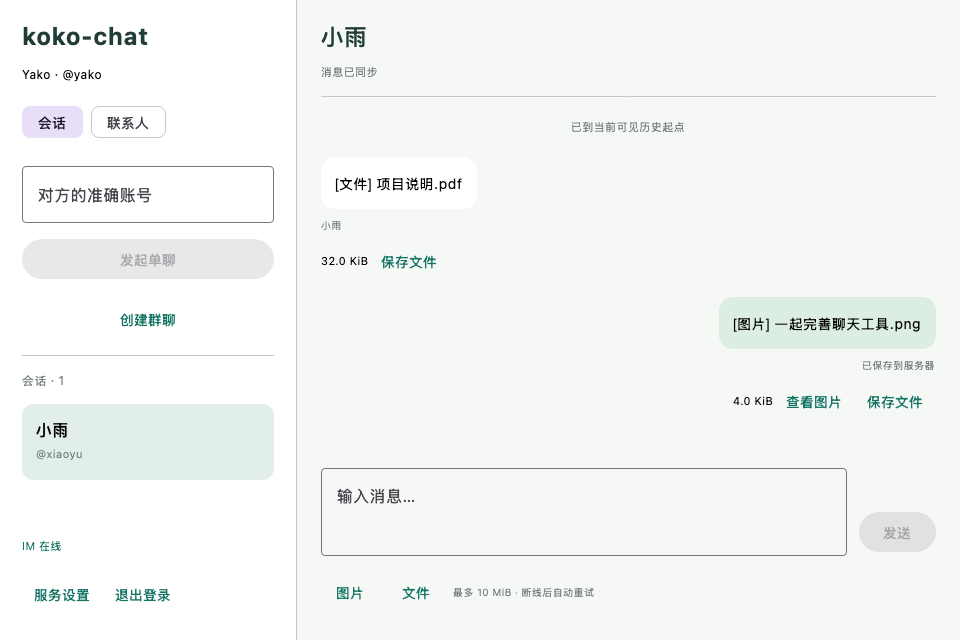
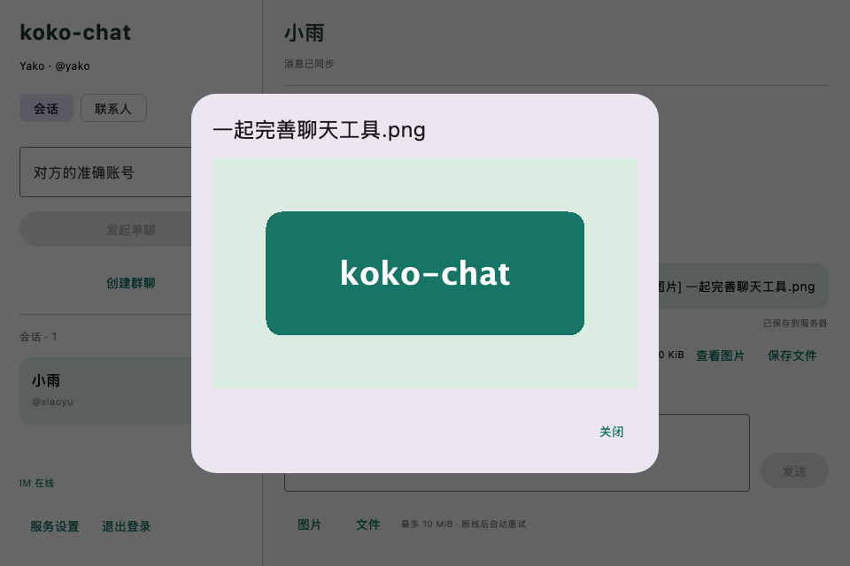

# RustFS 图片与文件验收

日期：2026-09-08。已在 koko-chat 实现 RustFS 私有存储、附件 HTTP 接口、Netty 附件消息与 Kotlin Compose Desktop 收发、预览及持久化重试。后端仍为 Java 21 / Spring Boot 3、常规 Service 分层；RabbitMQ 继续分发消息引用。

## 存储与操作

图片和文件字节保存在 RustFS 私有桶 `koko-chat`，对象键为 `attachments/<上传 UUID>`；容器 `/data` 使用 `koko-chat_rustfs-data` 命名卷。MySQL attachment 保存文件名、大小、SHA-256、所属用户/会话/成员周期与状态，message 只保存附件引用，不保存二进制图片。

桌面端点击“图片”或“文件”选择内容。待发送文件先复制到当前账号的本机目录，再上传和发送；消息确认落盘后删除副本。对端可查看 PNG/JPEG 图片或选择位置保存文件。每次读取都经认证 HTTP 重新检查当前会话权限，客户端校验长度和摘要，不公开 S3 地址。

本机 S3 API 为 `127.0.0.1:9000`，控制台为 `127.0.0.1:9001`；凭证仅在未跟踪的 deploy/.env 中。配置与版本说明见 [部署文档](../deploy/README.md)，请求和错误码见 [附件契约](../contracts/attachments.md)。

## 实际验证

| 验证 | 结果与范围 |
| --- | --- |
| 后端完整 verify | 27 项，0 失败、0 错误；独立数据库用例在本命令跳过，其余 26 项通过 |
| 独立 MySQL 迁移验证 | 单独执行通过；V1–V4 首次迁移、重复迁移及既有约束/事务验证，11 张业务表，临时库结束删除 |
| RustFS 附件集成测试 | 真实 32 KiB 文件上传/下载、长度和 SHA-256 拒绝、READY/ATTACHED 幂等、重复发送只保存一条消息和 Outbox、同附件重复绑定不消耗序号 |
| 失败恢复 | 注入存储故障后保留 PENDING 可重试；注入 Outbox 插入故障后附件 READY、消息与序号全部回滚；验证固定键顺序的正文摘要 |
| 访问范围 | 无令牌 401、旁观者 403、私有桶匿名读取 403、未发送附件不可下载；群成员移除及重入后均不能读旧附件；有效 PNG 识别为 image/png，伪装 SVG 被拒绝 |
| 桌面完整联调 | 29 项单元/集成/Compose 测试全部通过，无失败或跳过，包含既有认证、好友、群聊、已读与历史分页回归 |
| LiveAttachmentClientTest | 两个真实客户端、真实 MQ 推送；丢弃首次上传成功响应后复用原 UUID，READY 状态无需再次上传；删除原文件不影响发送，接收方保存字节及图片预览与原内容一致；注销清空预览 |
| SQLite | 原始 v1 缓存通过生产驱动迁移到 v3，消息和游标保留；附件副本跨重开存在、原文件可删除、对方碰巧使用同编号不会清理本机副本；自己的确认后删除；新周期不自动重发旧文件 |
| Compose / 打包 | 960×640、1120×760 实际组件离屏渲染；图片弹窗和按钮可见。createDistributable 与 macOS packageDmg 成功 |

最后的界面复核显式向 ImageComposeScene.render 传入递增时间：其默认时间为 0，会让弹窗动画停在半透明中间帧。修正测试时钟后两项渲染测试通过，并检查生成的最终 PNG。此前 UI/SQLite 定向 6 项测试与再次打包也均通过。没有用图片替代实际组件，也没有自动操作系统文件对话框或安装 DMG。

联调脚本增加 l/m 测试账号，清理前用独立 Java 入口按随机前缀精确查询其附件对象键，再删除对象和 SQL 关联记录。完整联调实际清理 2 个 RustFS 对象；结束核查 attachment 记录及 dsk_ 测试账号均为 0，Flyway 1/2/3/4 均成功。凭证、真实数据库、测试临时目录与构建产物不纳入 Git。

复现（先设置 JDK 21、deploy/.env 并启动四个中间件）：

```bash
./scripts/verify-database.sh
./scripts/verify-auth.sh
KOKO_CHAT_RENDER_DIR=/tmp/koko-chat-attachment-preview \
  ./scripts/verify-desktop-auth.sh createDistributable packageDmg
```

## 界面

以下为实际 Compose 组件使用固定演示数据渲染，仅用于布局验收；线上链路由上述双客户端测试验证。





## 当前边界

单文件最多 10 MiB，PNG/JPEG 图片最多 4,194,304 像素，每实例上传/下载共用 4 个并发名额。本页是初始附件阶段记录，随后已补齐缩略图与未发送上传过期清理，见 [本轮验收](voice-verification.md)。仍无分片续传、存储配额或病毒扫描；本机失败副本和 EXPIRED 墓碑保留。下载开始时校验权限，已开始的传输和用户此前保存的本地文件不会被远程撤回。RustFS 使用固定 RC.5 候选版本的单节点开发部署，未验证生产高可用或大规模性能。
