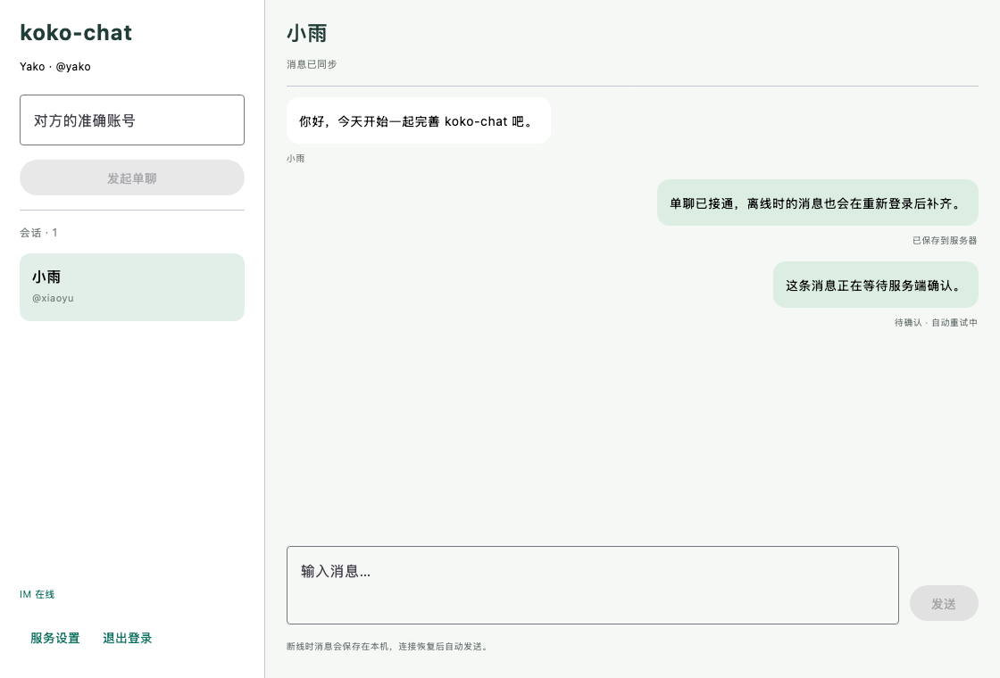
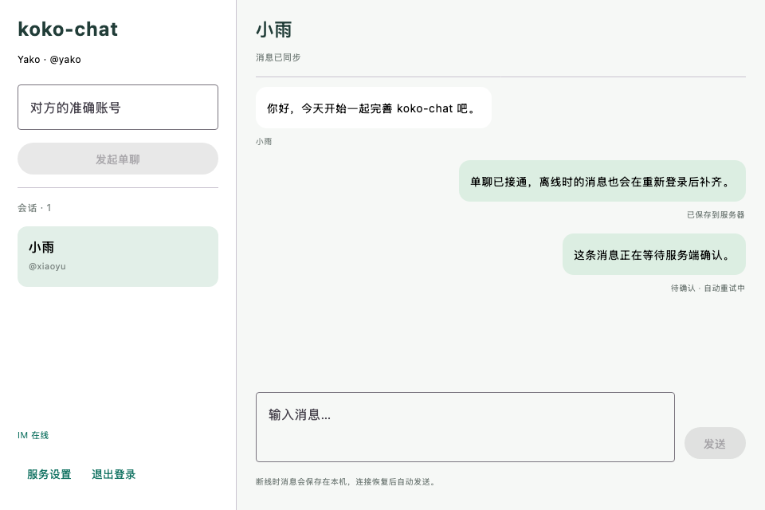

# 单聊阶段验收记录

日期：2026-09-08。基于本机真实 MySQL 8.4、Redis 7.4、RabbitMQ 4.2，Java 21 / Spring Boot 3.5.16、Kotlin / Compose Desktop。旧 IM 仓库未修改。

## 当前交付

- 按准确账号建立唯一单聊、会话列表、文本消息和固定上界历史分页；当前不要求先加好友。
- Netty SEND 经过身份和成员校验，message、会话 seq 与 Outbox 同事务保存。相同发送者与 clientMsgId 重发返回同一条消息。
- RabbitMQ 持久分发、独占网关投递、确认/退回检查、5/30/120 秒重试和死信，Redis 保存短租约在线路由。
- Kotlin 聊天界面、按账号隔离的 SQLite 历史和待发送记录、连续接收游标、离线补拉与自动重试。
- 新增代码中的中文注释解释事务、幂等、回执及协程生命周期。服务端复用 V1 的聊天/Outbox/游标表，无须修改已经应用的 Flyway 迁移。客户端新增独立 ChatDatabase，不改设置库 schema。

## 执行结果

| 验证 | 结果 |
| --- | --- |
| 后端 `verify-auth.sh`（名称保留，现含 ChatIntegrationTest） | 18 项，17 通过，1 跳过；跳过的是需单独启用的 MySQL 建库测试 |
| 桌面 `verify-desktop-auth.sh` + 离屏渲染 | 15 项全部通过，包含真实客户端测试，无跳过 |
| `createDistributable` / `packageDmg` | 成功生成携带 Java 运行时的 app 和 DMG |
| 1120×760、960×640 实际 Compose 聊天组件 | PNG 人工查看，无明显裁切；演示数据仅用于截图 |

后端测试实际覆盖并发建单聊、重复 SEND、内容冲突、历史固定上界、成员越权、成员周期变化、设备游标单调性、Outbox 写入失败事务回滚、发布失败保留任务、过期租约恢复、旧租约 CAS 拒绝、mandatory 无绑定路由退回、畸形事件进入死信，以及真实 5 秒 TTL 回流。

`LiveChatClientTest` 使用两个真实 Ktor 客户端完成注册、票据认证和收发，直接订阅接收方 MESSAGE，确保通过条件包含 MQ 推送而非只依赖 HTTP 补拉。测试故意丢弃发送方第一次 SEND_ACK 并忽略它自身的推送，确认客户端实际再次发送相同 clientMsgId，最终只有一条消息。接收方退出后再次登录，历史自动补齐到 seq=2。

`ChatStoreTest` 使用真实 SQLite 文件，验证重新打开后待发送记录仍存在、不同账号互不混用、乱序消息不跳过缺口、重复消息不增加行数、对方复用 clientMsgId 不会清除自己的待发送记录，以及成员周期变化后旧消息失效。联调中发现并修复了新会话 selectedId 与列表分开更新导致立即发送被跳过的问题。

## 复现

先准备 `deploy/.env` 并启动本项目中间件，设置有效 JDK 21：

```bash
./scripts/verify-auth.sh
KOKO_CHAT_RENDER_DIR=/private/tmp/koko-chat-preview \
  ./scripts/verify-desktop-auth.sh createDistributable packageDmg
```

第二条在 macOS 打包 DMG，其他系统改用对应平台任务。脚本使用最新 `server/target/koko-chat-server-0.1.0-SNAPSHOT.jar`，临时服务端口默认 18080/18081；若被占用则拒绝启动。测试结束停止临时后端，按随机账号前缀清理本轮会话、消息、Outbox、设备游标与账号。后端 MQ 集成测试另用随机队列前缀，结束删除其队列和交换机。

开发数据库本机使用 3307，避免影响已有的 3306 服务；实际端口和凭证以未提交的 `deploy/.env` 为准。不在文档中保存测试令牌或密码。

## 范围与限制

这是单机开发环境下的文本单聊闭环，尚无好友申请、群聊、图片文件、撤回、未读计数或用户已读。桌面目前显示最近 200 条本地消息，没有向上加载更早历史的界面；后台同步会保存全部拉到的可见消息。注销会关闭账号资源并清空页面，保留未加密的本机历史缓存供下次登录。

MQ 的 30/120 秒档位和重试耗尽路径已有实现，当前真实等待测试只覆盖 5 秒档位和畸形事件死信；未做 broker 宕机/多副本容灾、多节点路由重连或容量压测。完整目标与当前简化实现的差异列于 [消息队列设计](messaging.md) 开头。界面验证使用真实组件离屏渲染，未自动操作系统窗口的键盘、焦点或关闭按钮。

## 界面

以下为实际 ChatWorkspace 组件使用固定演示数据渲染的截图，不是两个线上账号聊天过程的录屏。




