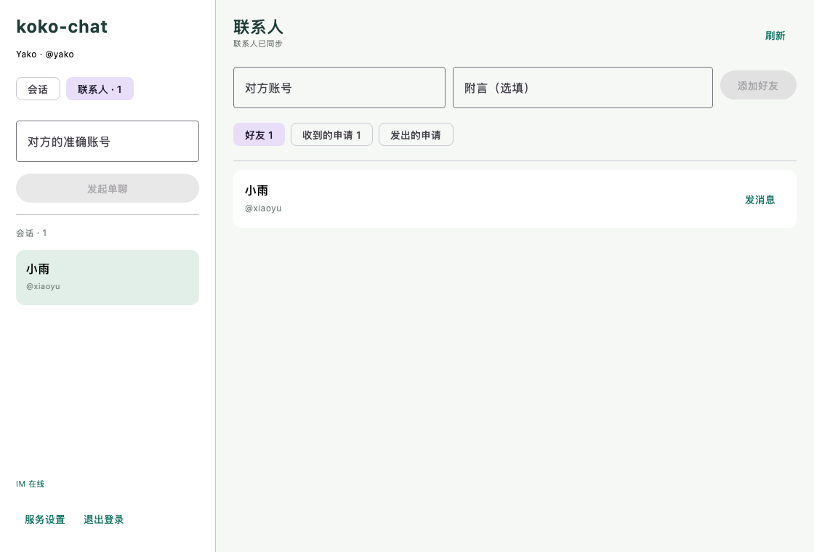
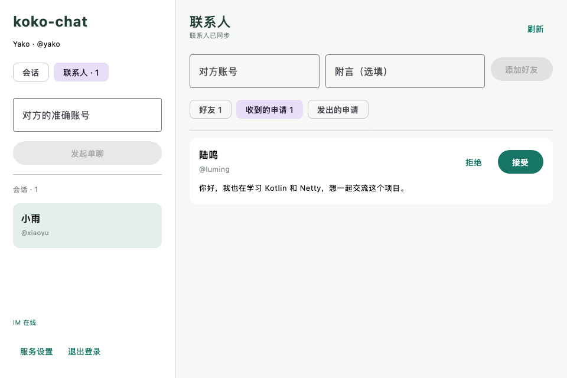
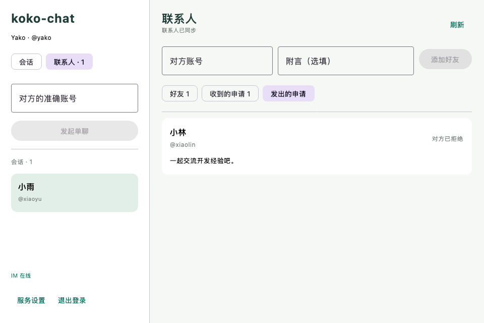

# 好友阶段验收记录

日期：2026-09-08。本轮在 koko-chat 新增好友申请、接受/拒绝、双向好友关系、联系人列表和联系人聊天入口。继续使用 Java 21 + Spring Boot 3 + Netty、RabbitMQ，以及 Kotlin + Compose Desktop；未使用 DDD，未修改旧 IM 项目。

## 已实现

后端提供五个好友 HTTP 端点，具体字段与错误码见 [联系人契约](../contracts/contacts.md)。同一用户对只有一条待处理申请；重复发申请返回原待处理记录，反向申请需要显式接受。处理人由令牌身份确定，只有接收方可以决定。双向 friendship 与申请终态在同一事务提交，统一按数值用户 ID 顺序加锁。已应用的 V1/V2 Flyway 文件保持不变，直接复用既有好友表。

桌面增加“联系人”入口及待处理数量，提供“好友 / 收到的申请 / 发出的申请”三页，支持准确账号、可选附言、接受/拒绝、手动刷新和从好友卡片发消息。ContactModel 的刷新和修改串行处理，旧账号任务取消后不能回写新账号；响应丢失时提示结果未确认，不清空输入或假装成功。

系统信息的 local 阶段更新为 `contacts`，仍包含原有认证和单聊功能；默认 skeleton 保持无需中间件。

## 测试结果

| 检查 | 结果 |
| --- | --- |
| 后端 `verify-auth.sh` | 21 项：20 通过、0 失败、1 跳过（独立建库测试未启用） |
| 桌面完整联调、状态测试和渲染 | 17 项全部通过，无跳过 |
| Compose 离屏渲染 | 联系人、收到申请、发出申请，1120×760 和 960×640 均生成并检查 |
| `createDistributable` / `packageDmg` | 成功，更新可运行 app 和 macOS DMG |

ContactIntegrationTest 使用真实 MySQL 验证：

- 双方同时互加时，一方成功、另一方收到反向待处理冲突；没有重复申请。
- 同方向重试返回同一 ID；并发接受只建立两条方向关系。
- 第二条好友关系写入异常时，第一条关系与申请终态均回滚。
- 拒绝可重复调用；拒绝后可重新申请，记录 ID 不同；已拒绝申请不能改成接受。
- 收发方向、状态筛选和游标分页正确；第三方看不到申请，发送者和第三方都无权接受。
- 无令牌 401；添加自己、超长附言、非法分页和筛选值被拒绝。

LiveChatClientTest 使用两个真实 Ktor 客户端完成“申请 → 拒绝 → 再申请 → 接受 → 双方好友列表更新 → 从联系人创建会话”，随后继续验证 RabbitMQ 推送、丢失 SEND_ACK 后使用原编号重试，以及离线消息补拉。注销会清空联系人页面，再次登录恢复服务端好友列表。

ContactModelTest 验证旧账号请求迟到不能污染新账号，以及申请在服务端保存但响应丢失时，客户端保持未确认状态、经刷新看到真实申请。

## 复现与边界

准备本项目 `deploy/.env`、启动中间件并配置 JDK 21 后，在仓库根目录执行：

```bash
./scripts/verify-auth.sh
KOKO_CHAT_RENDER_DIR=/private/tmp/koko-chat-contact-preview \
  ./scripts/verify-desktop-auth.sh createDistributable packageDmg
```

打包 DMG 需 macOS。联调脚本使用最新后端 JAR，在 18080/18081 启动临时服务；结束关闭该进程，按本轮随机账号前缀清理好友关系、申请、会话、消息、Outbox、游标和账号，不清空业务表。已有认证/消息测试同时回归。文件及凭证不会写入本记录。

当前好友资料只保存在账号内存快照中，每 10 秒从 HTTP 分页刷新，也支持手动刷新；尚无联系人离线缓存或好友事件 MQ 推送。每轮刷新读取全部好友及申请页，适用于当前开发规模，长期大量申请的归档和增量同步仍待完善。聊天本身继续使用既有 RabbitMQ 分发与 SQLite 持久化链路。

为兼容上一阶段，本轮仍允许按准确账号直接聊天；好友关系不是当前发言权限条件。未实现取消申请、删除好友、拉黑、备注编辑、群聊及用户已读。界面检查为实际 Compose 组件使用固定数据的离屏渲染，未自动操作系统窗口的键盘和焦点。

## 实际组件截图

以下固定数据仅用于布局验收，不是线上账号操作录屏。






