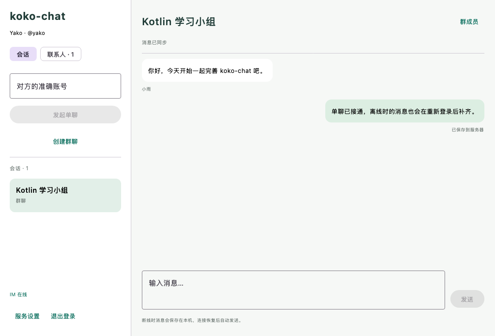
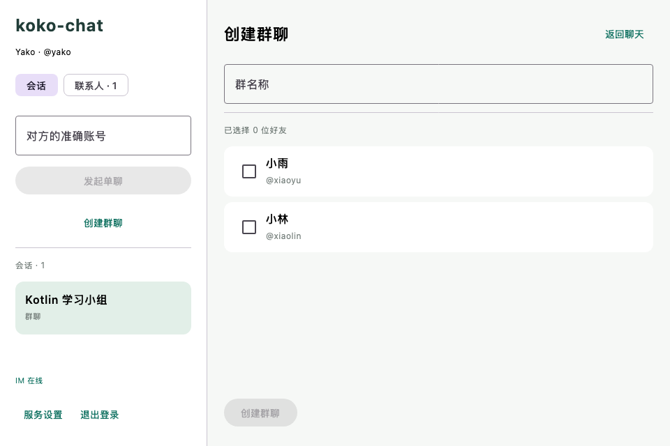
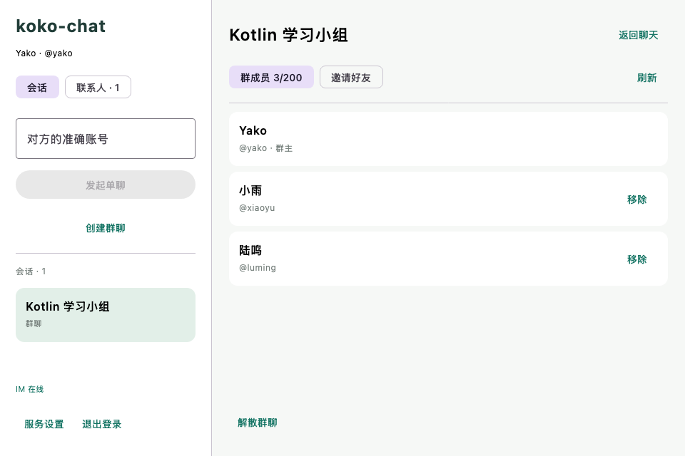

# 群聊阶段验收记录

日期：2026-09-08。在 koko-chat 完成建群、邀请好友、移除成员、普通成员退出、群主解散、群消息分发与成员周期隔离。继续采用 Java 21 + Spring Boot 3 + Netty、RabbitMQ、Kotlin + Compose Desktop 和普通 Service/Mapper 分层，旧 IM 仓库不变。

## 实现

- 群与单聊共用会话列表、消息表、SEND/ACK、Outbox 和 RabbitMQ 两级分发。群消息按有效成员逐设备分发，网关再验证当前周期及可见序号；不复制群消息正文。
- 群主可邀请自己的有效好友，群最多 200 人；创建者自动成为群主。普通成员可退出，群主可移除其他成员或解散。
- 成员变更与发送、历史和回执使用同一会话行锁。加入时 joinSeq=latestSeq+1；重入分配新 membershipEpoch，只同步新周期消息。
- V3 新增 group_command，将规范化参数摘要和群 ID 与业务修改同事务保存。成功命令重试返回原结果，参数变化拒绝执行；旧移除命令不会对已重新入群的成员再次生效。
- Kotlin 桌面支持建群选好友、群成员列表、邀请、移除、退出和解散；有歧义的请求保留原操作供显式重试。原消息发送意图继续持久化到 SQLite。
- 目录中缺失的本机会话会单独向服务端核验，明确 403/404 才清除缓存；分页竞态或断网不会被解释为退群。重入后清理旧周期消息，失去权限的发送意图保持失败状态，不会被迟到网络错误重新激活。

HTTP 字段、权限和重放约定见 [群聊协议](../contracts/groups.md)。当前 local 阶段标识为 `groups`，默认 skeleton 仍无需中间件。

## 实际验证

| 检查 | 结果 |
| --- | --- |
| 后端完整回归 `verify-auth.sh` | 24 项：23 通过，1 项独立建库测试在此命令中跳过 |
| 独立 `verify-database.sh` | 1 项通过，覆盖全新库 V1–V3、重复迁移、约束及事务检查 |
| 桌面完整联调与离屏渲染 | 18 项全部通过，无跳过 |
| `createDistributable` / `packageDmg` | 成功生成更新后的 app 与 DMG |
| 1120×760 / 960×640 | 检查真实群聊、创建群聊及成员管理组件，无明显裁切 |

GroupIntegrationTest 使用真实 MySQL，覆盖群主/成员权限、非好友邀请拒绝、新成员历史起点、移除后发送与历史拒绝、重入周期变化、旧回执拒绝、旧移除命令重放、退出与解散、并发重复建群、同编号不同参数冲突和命令记录写入失败回滚。人数边界测试构造 199 人的群，同时邀请两名好友，只有一人成功，最终恰为 200 人。

LiveGroupClientTest 使用三个真实 Ktor 客户端，通过好友 API 建立邀请关系，再以 GroupModel 创建群聊。测试故意丢弃第一次建群成功响应，随后显式重试，确认实际发出两次同编号命令而只有一个群。群主发送后直接观察另外两名成员的 MESSAGE 事件，证明经过 MQ/Netty 推送，而非仅通过 HTTP 补拉。

测试继续移除一人，确认其本机会话被隐藏，原认证连接发送消息收到 NOT_A_MEMBER；另一成员仍收到新消息。被移除者重新加入后只看到 seq=3 的新周期消息，没有收到 seq=2 的移除期间消息。最后验证普通成员退出、群主解散及剩余成员的目录清理。原认证、好友、单聊确认丢失重试与离线补拉测试同时通过。

ChatStoreTest 额外验证缓存删除后，迟到的重试操作不会重新激活失去权限的发送意图，重入后本地消息和连续游标按新起点初始化。

## 复现与数据

先准备本项目 `deploy/.env`，启动 MySQL、Redis 和 RabbitMQ，配置 JDK 21：

```bash
./scripts/verify-database.sh
./scripts/verify-auth.sh
KOKO_CHAT_RENDER_DIR=/private/tmp/koko-chat-group-preview \
  ./scripts/verify-desktop-auth.sh createDistributable packageDmg
```

DMG 任务适用于 macOS。联调脚本使用最新构建的后端 JAR，在 18080/18081 启动自己的临时服务。随机测试账号使用 a–g 后缀，结束清理本轮群命令、好友关系、申请、会话、消息、Outbox、设备游标和账号，并停止临时服务。独立迁移测试仅删除自己创建的随机测试库。

V1 和 V2 未改写；V3 新增后当前共 10 张业务表。SQLite 本轮仅新增查询，没有修改既有表结构，无须本地库迁移。

## 当前边界

群管理未确认操作只保存在当前账号内存中，注销或关闭应用后不自动恢复，重开应先刷新群列表核对结果。服务端成功命令记录持久保存，尚无归档机制。成员元数据每 10 秒通过 HTTP 刷新，尚无入群/退群系统消息或成员变更 MQ 事件。

支持 1–200 人的小群。未实现改群名、群主转让、管理员、群公告、邀请审批、用户已读、未读数、撤回和多媒体。解散后服务端消息仍保留，但普通聊天接口不再允许成员访问；无法远程撤回已经交付的本机数据或正在传输的消息。

RabbitMQ 开发环境仍为单节点，未做多节点容灾或容量压测。网关任务按设备发送，尚未按节点批量聚合。离屏图片使用固定演示数据，未自动操作系统窗口的键盘、焦点或关闭按钮。

## 界面






