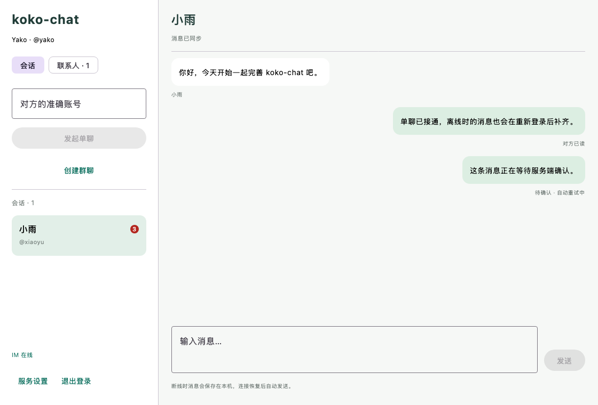
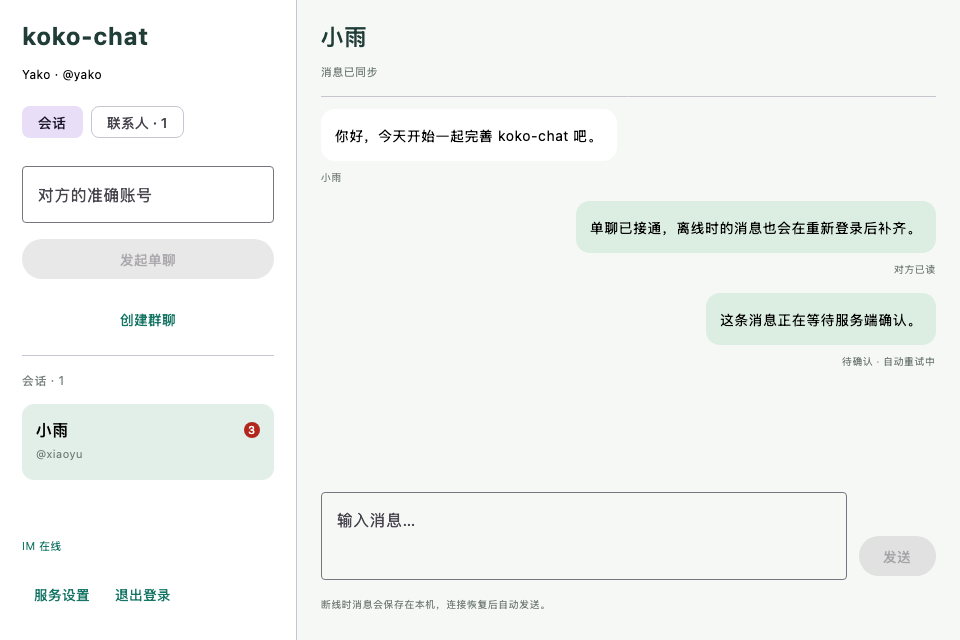

# 已读回执与未读计数验收

日期：2026-09-08。项目：koko-chat。当前 `local` 阶段为 `read-receipts`，保持 Java 21 / Spring Boot 3 / Netty / RabbitMQ 与 Kotlin Compose Desktop，采用普通业务分层。

## 已实现行为

- `READ → READ_ACK`：用户在当前成员周期的已读位置以最大值合并，多设备共享；必须先确认本设备连续接收范围，不能越界替其他人阅读。
- 会话摘要增加 `lastReadSeq`、`unreadCount`、`peerLastReadSeq`。未读数按可见消息统计，排除自己发送的消息；单聊显示“对方已读”，群聊只维护自身进度，不显示“所有人已读”。
- MySQL 提交后通过 RabbitMQ 的现有 gateway.x 定向提示在线设备。网关复核登录身份和成员周期并重查摘要，再通过 Netty 推送 READ_UPDATE。丢失提示时由每 10 秒 HTTP 快照恢复，不影响已经提交的已读事实。
- 窗口有焦点、聊天区可见、未被设置或其他业务面板遮挡时，消息底部在视口停留 500 毫秒后保存阅读位置。初次打开定位到最新消息，后续推送不打断历史阅读，提供“查看最新消息”入口。
- SQLite `pending_read` 保存待确认位置，响应丢失按原进度重试，退出重登继续补报。成员周期变化或失去访问权限时清理，迟到回执不能恢复旧会话；v1 消息库自动迁移到 v2。

## 自动验证结果

| 检查 | 结果与覆盖 |
| --- | --- |
| 后端 `verify-auth.sh` | 25 项中 24 项通过，独立数据库测试按开关跳过；覆盖原认证/好友/聊天/MQ/群聊，以及多设备并发 READ、单调性、未读排除自身、设备范围、外部用户与旧成员周期拒绝 |
| 独立数据库 `verify-database.sh` | 1 项通过；临时库执行 V1–V3，10 张业务表，重复迁移无新增执行，结束后删除该临时库 |
| 桌面端完整 `verify-desktop-auth.sh` | 22 项全部通过，无跳过；含真实 CIO 客户端、MySQL/Redis/RabbitMQ/Netty 联调 |
| `LiveReadClientTest` | 两个账号、三个独立设备；后台收到不已读、自己的消息不计未读、实际 READ_UPDATE 到达发送方与另一设备、READ_ACK 丢失后相同进度重试、本地阅读后退出重登补报、丢弃通知后 HTTP 快照恢复 |
| `ChatStoreTest` | 乱序缺口约束、阅读意图重开持久化、快照以外推送计数、旧快照不回退、成员周期清理、迟到响应不复活会话、真实 v1 缓存升级保留消息 |
| `ReadVisibilityTest` | 实际 Compose 离屏布局；注入焦点状态，验证无焦点、设置遮挡、联系人页均不报告 READ，前台可见聊天才报告 |
| 分发构建 | `createDistributable` 与 `packageDmg` 成功，生成 macOS `.app` 与 `koko-chat-1.0.0.dmg` |
| 清理与运行状态 | 本次检查时测试账号、群命令、消息均为 0；临时 18080/18081 端口关闭，三个中间件健康，Flyway 1/2/3 均成功 |

重现入口（先准备 JDK 21、deploy/.env 和中间件）：

```bash
./scripts/verify-auth.sh
./scripts/verify-database.sh
KOKO_CHAT_RENDER_DIR=/tmp/koko-chat-read-preview \
  ./scripts/verify-desktop-auth.sh createDistributable packageDmg
```

脚本沿用随机前缀隔离账号，已将新联调账号 h/i 纳入定向清理。测试和安装包产物位于 build/target，本机凭证与运行数据不提交。

## 界面检查

以下截图来自实际 Compose 组件的离屏渲染，使用固定演示数据，验证未读徽标和发送消息的阅读状态；不代表截图中的账号存在于真实服务。





## 实现边界

READ 表示客户端报告“读到此处”，不是眼动检测；用户打开会话定位到末尾后，会按该位置推进阅读。测试覆盖 Compose 对焦点状态的响应，未自动操作系统窗口验证原生焦点事件。

READ_UPDATE 是可丢失的状态提示，复用有界临时网关队列；不进入聊天消息 Outbox、重试或死信链。数据库已读状态仍是事实源，不能把 MQ 或 Socket 确认解释为用户阅读。

MySQL 精确 COUNT 与 SQLite 缓存计数尚未做大规模积压性能测试；本次为单后端、三设备功能验收，不代表多节点或生产容量测试。聊天窗口仍展示最近 200 条缓存消息，历史向上分页、文件与图片消息、托盘通知尚待实现。

协议见 [聊天契约](../contracts/chat.md)，数据库演进见 [数据库说明](database.md)。
