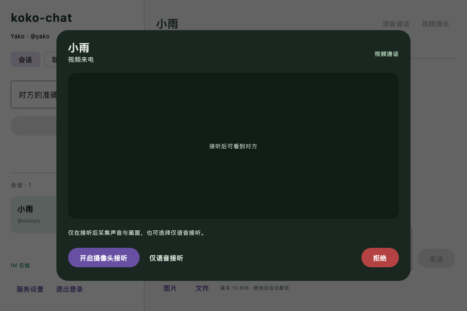
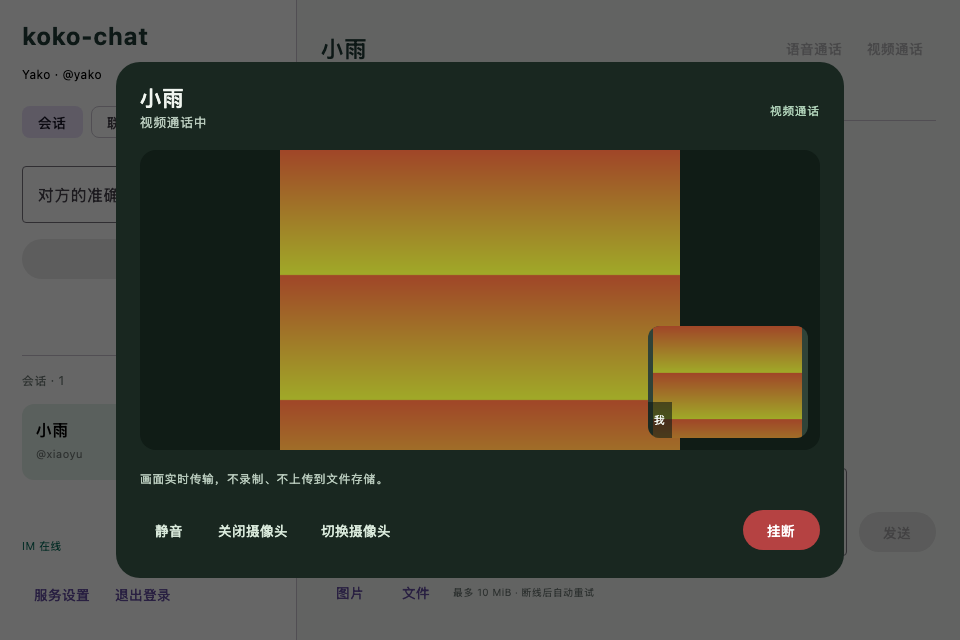

# 一对一视频通话验收

日期：2026-09-08。后端继续使用 Java 21 / Spring Boot 3 / Netty / 普通 Service 分层，桌面使用 Kotlin Compose 和现有 webrtc-java 0.16.0。视频沿用语音的控制链路与生命周期，未引入 DDD 或新的媒体服务。

## 已实现

- 单聊可分别发起语音和视频。被叫看到明确的视频来电，可开启摄像头接听，也可先仅语音接听，之后主动开摄像头。
- 通话面板显示远端视频、本机镜像预览、静音、摄像头开关/选择和挂断。摄像头缺失或不可用时保留语音；关闭会停止采集并清空本机画面。
- 媒体类型由后端固定，重复创建换类型会冲突。摄像头状态由绑定设备上报，其他设备无权修改。MEDIA 不占信令邮箱，开关摄像头不重复协商 SDP。
- V8 增加媒体类型和摄像头字段，旧记录和省略类型的请求仍为 AUDIO。视频信令限制、按字节分页和客户端收包上限已同步调整。
- 帧经 WebRTC 直连或 TURN 传输，不经过 Netty/RabbitMQ/RustFS。画面只保留在内存中，限制输入像素、输出尺寸和刷新率，处理旋转；退出、断线、挂断清理采集与画面。

## 实际验证

后端完整回归：34 项，0 失败、0 错误，其中独立数据库与双节点用例按设计跳过，其余 32 项通过。本轮单独执行数据库用例 1 项，通过 V1–V8 首次迁移和重复迁移，仍为 15 张业务/运维表。新增状态机用例覆盖类型兼容与冲突、设备权限、摄像头幂等上报、超限信令拒绝、快照分页和结束时清空状态。

原生像素测试使用合成 I420 色块，通过真实 PeerConnection 传输，检查接收帧尺寸和颜色，独立检查旋转后的尺寸；不是仅检查 SDP 或连接状态。修正了直接释放同尺寸裁剪包装产生的空句柄问题，渲染现在直接复制 I420 像素，借用帧在回调结束时释放。

桌面完整回归 35 项全部通过，0 失败、0 错误、0 跳过，用时约 3 分 8 秒。createDistributable 与 packageDmg 成功，产物为 `apps/desktop/build/compose/binaries/main/dmg/koko-chat-1.0.0.dmg`。完整联调包含真实登录、Netty CALL、RabbitMQ 唤醒、双端音视频、语音确认丢失恢复、先仅语音接听后开启视频、摄像头状态同步及退出清理；TURN 用例强制 RELAY 且验证音频与视频均到达。针对接听提交期间的重复点击另补真实双客户端回归 1 项，通过；确保首次选择仅语音后，重复操作不能意外开启摄像头。修复后已重新生成安装包，针对性联调与打包用时约 54 秒。

本机 Flyway V8 成功；完整联调后 call_session、call_signal 与 dsk_ 测试账号均为 0，清理了本次附件对象 2 个，已有数据库、缓存、MQ、RustFS、TURN 和监控继续运行。

## 界面验收

以下为实际 Compose 组件在 960×640 窗口的离屏渲染，画面使用合成色块，不是用户摄像头内容。已检查来电选择、挂断按钮、远端画面和本机预览均可见，无布局裁切。





## 复现

先配置 JDK 21、deploy/.env，启动开发依赖和可选 TURN，构建最新后端 JAR；再运行：

```bash
./scripts/verify-auth.sh
./scripts/verify-database.sh
KOKO_CHAT_RENDER_DIR=/tmp/koko-chat-video-preview \
  ./scripts/verify-desktop-auth.sh createDistributable packageDmg
```

若默认 18080/18081 已占用，设置 `KOKO_CHAT_VERIFY_HTTP_PORT` 和 `KOKO_CHAT_VERIFY_IM_PORT` 使用其他空闲端口，不停止现有进程。验证脚本按精确随机账号范围清理测试数据和对象。

启动真实客户端，双方登录同一个后端并打开单聊，点击“视频通话”，对方接听后允许系统使用摄像头与麦克风。包内已有相应用途说明；更换后端后应同时更新两端客户端。

## 验收边界

自动化只采集合成媒体，没有打开用户摄像头、录制人声或自动处理系统权限弹窗。真实摄像头驱动、macOS 授权交互、物理双机、公网 NAT、Windows/Linux 和长时间 CPU/内存表现仍需设备验收。TURN 验证使用本机 Docker，不等同公网部署验证。

当前不含屏幕共享、群视频、录制、ICE restart、通话中语音升级视频或通话历史页面。摄像头状态通过既有同步链路传播，关闭提示可能有短暂延迟；远端画面连续 3 秒未更新显示等待占位，摄像头采集连续 5 秒无帧则停采集。详见 [音视频协议](../contracts/voice-calls.md)。
