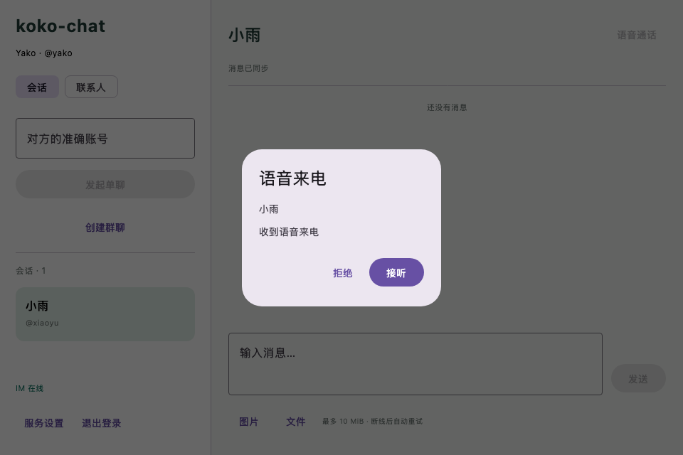
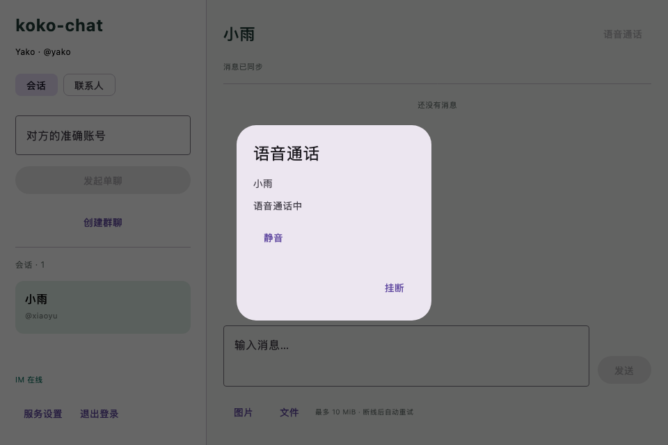
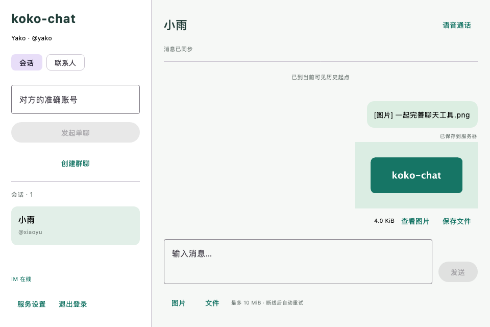

# 语音、缩略图与过期清理验收

日期：2026-09-08。后端保持 Java 21 / Spring Boot 3 / Netty / 普通 Service 分层，客户端保持 Kotlin / Compose Desktop。新增一对一语音、RustFS 私有缩略图及未发送附件回收。

## 已实现行为

- 单聊标题栏发起语音，来电可接听/拒绝；通话支持静音与挂断。WebRTC 传音频，Netty 传控制与信令，RabbitMQ 只推状态变化提示，MySQL 为状态和短期信令的权威来源。
- 多设备只有首个接听者获得归属；忙线拒绝、45 秒响铃/协商超时、30 秒双端活动租约。确认丢失复用原呼叫/信令编号，已结束通话不重新激活。连接失效释放本机媒体。
- 图片上传生成最长边 320 像素的 JPEG 缩略图，旧图首次读取补生成。原图和缩略图在同一个 RustFS 私有桶，使用 attachments/ 与 thumbnails/ 前缀，下载权限相同。
- 未发送附件默认 24 小时到期；上传开始保证至少 10 分钟有效期。后台每 60 秒在会话锁内将过期 PENDING/READY 转为 EXPIRED，再删除对象。删除失败重试，墓碑每小时复扫覆盖晚到写入。已绑定消息的 ATTACHED 不回收。

## 实际验证

| 项目 | 结果 |
| --- | --- |
| 后端完整 verify | 29 项，0 失败、0 错误；独立数据库用例跳过，其余 28 项通过 |
| 独立 MySQL | V1–V6 首次迁移与重复迁移通过，13 张业务表；临时库删除，local 库升级到 V6 |
| 附件回归 | 800×400 PNG 生成 320×160 缩略图，返回摘要与字节一致；已发送对象在到期后保留；未发送对象过期拒绝上传/发送，删除失败重试和晚到写入复删通过 |
| 通话状态机 | 并发抢接只有一台设备成功，其他设备不能挂断或读信令；陌生用户拒绝、忙线、信令去重、双方确认连接、结束清理信令、超时后迟到接听均验证 |
| 双客户端语音 | 真实认证、Netty、RabbitMQ 唤醒和原生 WebRTC；静音/挂断通过；主动丢弃 CREATE、ACCEPT、SIGNAL、CONNECTED、END 成功响应后恢复，信令实际复用原编号重发 |
| 桌面完整回归 | 33 项全部通过，0 失败、0 错误、0 跳过；覆盖既有认证、好友、群聊、已读、历史、附件与新增语音 |
| Compose 与安装包 | 实际组件渲染通过；createDistributable 与 packageDmg 成功，包内包含 macOS ARM64 原生 WebRTC JAR，Info.plist 含麦克风/摄像头用途 |
| 原生媒体 | 两个真实 PeerConnection 使用虚拟音源，在直连和强制 TURN relay 两种模式下均连接成功，双方收到音频帧并释放资源；没有录制用户声音 |
| 原生设备探测 | macOS Apple Silicon 原生库加载，枚举到 8 条音频编解码能力、1 个音频输入和 1 个视频设备；只枚举，没有调用摄像头采集 |

完整桌面命令用时约 3 分钟，语音客户端用例约 3 秒。安装包位于 `apps/desktop/build/compose/binaries/main/dmg/koko-chat-1.0.0.dmg`，构建产物未提交 Git。联调结束清理 2 个附件及其可能存在的缩略图对象键；核查 attachment、call_session、call_signal 和 dsk_ 测试账号均为 0，Flyway 1–6 全部成功。MySQL、Redis、RabbitMQ、RustFS 健康，coturn 正常运行。

原生库固定为 webrtc-java 0.16.0，TURN 固定 coturn 4.17.2-r0。TURN 测试使用限时 HMAC 凭证与本机 Docker，发现并修正通配中继地址导致 CREATE_PERMISSION 403 的问题；最终绑定容器真实网卡，移除了临时 verbose 调试参数。

## 界面

以下是实际 Compose 组件离屏渲染，使用演示数据检查布局；网络行为由上述真实客户端测试验证。没有用图片冒充应用页面，也未自动操作系统权限弹窗。







## 复现

先设置 JDK 21、补齐未跟踪的 deploy/.env，启动 MySQL、Redis、RabbitMQ、RustFS 及可选 TURN：

```bash
docker compose --env-file deploy/.env -f deploy/compose.yaml --profile calls up -d
./scripts/verify-database.sh
./scripts/verify-auth.sh
KOKO_CHAT_RENDER_DIR=/tmp/koko-chat-voice-preview \
  ./scripts/verify-desktop-auth.sh createDistributable packageDmg
```

未配置实时环境的普通 Gradle 测试会明确跳过集成用例；TURN 测试也需 URL 和共享密钥。联调脚本使用临时后端、随机账号前缀 a–o，结束按精确账号范围先清理 RustFS 对象，再删除附件、通话信令及关联记录，不删除业务数据。

## 当前边界

本轮交付语音单聊。视频只完成设备枚举，没有摄像头预览、视频通话或屏幕共享；没有群通话、铃声、托盘来电、录音和通话历史页面。macOS 麦克风/摄像头用途写入安装包，但真实设备授权、双物理机人声收听、公网 NAT、Windows/Linux 和签名公证尚未验收。虚拟音源的音频帧验证不能证明真实麦克风和扬声器体验。

开发 TURN 只监听本机映射端口、允许回环对端且未启用 TLS，不能直接作为公网部署配置。语音没有 ICE restart，断线结束后需重新拨打。通话期间可操作接听/静音/挂断，弹窗会遮挡聊天区。

附件清理只处理服务端有元数据的未发送对象；本机永久失败副本、EXPIRED 墓碑和通话状态元数据保留，未做全桶孤立对象扫描、用户配额或病毒扫描。系统故障时到期与物理删除之间存在重试窗口。详见 [附件契约](../contracts/attachments.md)、[语音契约](../contracts/voice-calls.md) 和 [部署说明](../deploy/README.md)。
